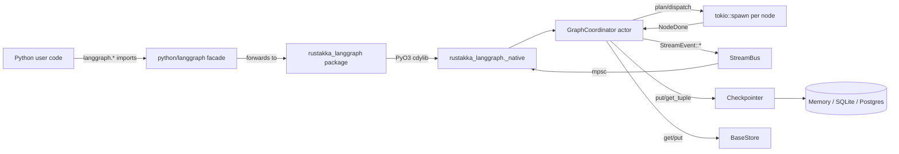

# Architecture

`rustakka-langgraph` is a faithful Pregel/BSP runtime for
[LangGraph](https://github.com/langchain-ai/langgraph) written in Rust on
top of the [rustakka](https://github.com/cognect/rustakka) actor system.
Python remains the *authoring* surface (via PyO3 bindings) while the
*engine* — planning, dispatch, channels, checkpointing, streaming —
executes GIL-free in Rust.

This document explains how those pieces fit together so that contributors
can reason about correctness and extend the system without breaking
parity with upstream LangGraph.

## 30 000-ft view



Highlights:

- **One coordinator per run.** `GraphCoordinator` is a rustakka `Actor`;
  every `invoke`/`stream` call spawns a fresh coordinator so runs are
  isolated and cancellable without touching shared state.
- **Actors over locks.** Channel ledgers, the pending-task set, and the
  stream subscriber list all live inside the coordinator's private
  state — the actor mailbox serialises all mutations, eliminating the
  need for mutexes on the hot path.
- **GIL-free core.** Everything under `crates/rustakka-langgraph-*` is
  pure Rust. The PyO3 layer acquires the GIL only to (a) call user
  callables and (b) marshal values across the FFI boundary.

## Crate topology

| Crate | Responsibility |
| --- | --- |
| `rustakka-langgraph-core` | Pregel engine: channels, state, graph builder, `GraphCoordinator`, `NodeKind`, runner, streaming bus. |
| `rustakka-langgraph-checkpoint` | `Checkpointer` trait, `MemorySaver`, and the `CheckpointerHookAdapter` that bridges savers to the coordinator. |
| `rustakka-langgraph-checkpoint-sqlite` | `SqliteSaver` with upstream schema parity. |
| `rustakka-langgraph-checkpoint-postgres` | `PostgresSaver` + `AsyncPostgresSaver` alias, upstream DDL. |
| `rustakka-langgraph-store` | `BaseStore` trait, `InMemoryStore` with TTL and search. |
| `rustakka-langgraph-store-postgres` | `PostgresStore` + `AsyncPostgresStore` alias, upstream DDL. |
| `rustakka-langgraph-prebuilt` | `ToolNode`, `tools_condition`, `create_react_agent`. |
| `rustakka-langgraph-macros` | `#[derive(GraphState)]` macro (channel specs + reducers). |
| `rustakka-langgraph` | Umbrella re-export with feature flags (`sqlite`, `postgres`, `prebuilt`). |
| `rustakka-langgraph-profiler` | Cross-runtime profiler with `invoke`/`stream`/`fanout`/`checkpoint-heavy` scenarios. |
| `py-bindings/pylanggraph` | PyO3 cdylib exposing `rustakka_langgraph._native`. |

## The Pregel barrier

Every run advances as a sequence of *supersteps*. Each superstep has
three phases that execute strictly in order inside `GraphCoordinator`:

1. **Plan** — compute the next batch of `DispatchTarget`s from the graph
   topology, any outstanding `Command::goto`, and pending `Send`
   fan-outs. Update the recursion ledger and bail with
   `GraphError::Recursion` if the configured limit is exceeded.
2. **Execute** — spawn a `tokio::task` per target. The coordinator owns
   a `HashSet<task_id>` (`state.pending`). Each spawned task installs a
   task-local `StreamWriter` (see *Streaming*), invokes the node, and
   tells the coordinator `CoordMsg::NodeDone { task_id, node, result }`.
3. **Update** — once `pending` drains, aggregate writes through the
   channel reducers, emit `Updates` and `Values` stream events,
   checkpoint the new state (if a saver is attached), then route the
   next planning cycle from the post-update values.

The `task_id` (not the node name) is the dispatch identity. This keeps
`Send`-driven fan-out — where the same node name appears multiple times
in one superstep — race-free.

### Fan-out, Command, Interrupts, Subgraphs

- **`Command`** — a node can return `NodeOutput::Command(Command)` to
  combine explicit `goto`, arbitrary channel `update`s, and outbound
  `Send`s. Commands are interpreted during the Update phase *after*
  writes have been applied so conditional routers see the post-update
  values.
- **`Send`** — each `Send { node, arg }` becomes a fresh
  `DispatchTarget` in the *next* superstep with its `arg` injected as
  `__send_arg__` in the node's input map.
- **Interrupts** — a node returns `NodeOutput::Interrupted(Interrupt)`;
  the coordinator persists the snapshot, surfaces the payload to the
  caller, and pauses. Calling `resume()` rehydrates the channel state
  from the checkpoint and dispatches the interrupted node with the
  resume payload injected via `input_override`.
- **Subgraphs** — `NodeKind::Subgraph(Arc<dyn SubgraphInvoker>)` lets a
  compiled child graph participate as a single node. The parent
  coordinator treats its output as channel writes; the child owns its
  own coordinator and channel state.

### Resume semantics

`GraphCoordinator::start_run` treats every `StartRun` as follows:

- If a checkpointer is attached, try to load the latest snapshot.
- If the snapshot has a pending interrupt **and** a resume value, route
  straight to the interrupted node.
- Otherwise, always dispatch the graph's entry targets with whatever
  channel values were restored. This lets a finished thread be
  re-invoked to extend its state — a no-op run on a cleared topology
  would otherwise hang forever.

## Channels and state

Channels live in `GraphValues` (inside `state.rs`). Each channel has a
`ChannelSpec { name, reducer }` where `reducer` is one of:

- `last_value` — overwrite on write (default)
- `topic` — append-and-preserve-order
- `topic_unique` — set-like dedupe
- `merge_dicts` — merge `Value::Object`s
- `binary_add_numbers` / `binary_extend_arrays` — numeric / array reducers
- `add_messages` — upstream `BaseMessage` semantics, including removal
  by `remove` markers
- `ephemeral` — cleared at the start of every superstep

The `#[derive(GraphState)]` macro (`rustakka-langgraph-macros`) auto-
generates channel specs from `Annotated[..., reducer]` style type
annotations.

`GraphValues::snapshot()` returns a portable, JSON-serialisable
representation; `restore()` is the inverse. Checkpointers use these
unchanged — byte-for-byte compatible with upstream snapshots.

## Streaming

The `StreamBus` is a lightweight broadcast fan-out (not a rustakka actor
— it's on the hot path and we want minimal indirection). Events are
strongly typed:

| Event | Emitted when |
| --- | --- |
| `Values { step, values }` | End of every Update phase. |
| `Updates { step, node, update }` | Per-node reducer output during Update. |
| `Messages { step, node, message }` | Node calls `current_writer().message(..)`. |
| `Custom { step, node, payload }` | Node calls `current_writer().custom(..)`. |
| `Debug { step, payload }` | When `CompileConfig { debug: true, .. }`. |

Subscribers register with a list of `StreamMode`s; an empty list means
"all". Under the hood the coordinator installs a per-task
`CURRENT_WRITER` `tokio::task_local!`; nodes pick it up via the
`rustakka_langgraph_core::stream::current_writer()` helper.

See [streaming.md](streaming.md) for end-to-end samples in both Rust and
Python.

## Checkpointing

`Checkpointer` (in `rustakka-langgraph-checkpoint::base`) mirrors
upstream's `BaseCheckpointSaver`: `put`, `get_tuple`, `list`,
`put_writes`, plus `setup`. Implementations:

- `MemorySaver` — thread-safe `BTreeMap` keyed by
  `(thread_id, checkpoint_ns, checkpoint_id)`.
- `SqliteSaver` — `sqlx::sqlite` with the upstream DDL
  (`checkpoints`, `checkpoint_writes`, `checkpoint_blobs`,
  `checkpoint_migrations`). Pool-backed so concurrent runs don't
  serialise.
- `PostgresSaver` / `AsyncPostgresSaver` — schema-identical; supports
  custom `schema=` for multi-tenant deployments.

The coordinator talks to savers through `CheckpointerHook` — a small
trait exposing `put_step`, `get_latest`, and `put_writes`. The
`CheckpointerHookAdapter` implements that trait for any
`Checkpointer`, so new backends only need to implement the base trait.

Full details, including thread-id layout and restore semantics, in
[checkpointing.md](checkpointing.md).

## Python bridge

`crates/py-bindings/pylanggraph` is a single cdylib compiled to
`rustakka_langgraph._native`. Key components:

- `runtime.rs` — initialises a multi-thread tokio runtime shared
  between pyo3-async-runtimes and every `block_on` site.
- `py_state_graph.rs` / `py_compiled_state_graph.rs` — expose the
  graph builder and the compiled handle. Every call that drives the
  engine wraps its `block_on` in `py.allow_threads(..)` so the user's
  Python nodes can reacquire the GIL from worker threads without
  deadlocking.
- `py_callable_node.rs` — wraps any Python callable as a
  `NodeKind::Python`. Detects coroutines via `inspect.iscoroutine` and
  bridges them with `pyo3_async_runtimes::tokio::into_future`.
- `conversions.rs` — Python ↔ `serde_json::Value` bridge. JSON is the
  wire format on the FFI boundary: the engine never touches the GIL
  during message passing, and checkpoints are interchangeable with
  upstream Python.
- `py_savers.rs` / `py_stores.rs` — PyO3 wrappers over the concrete
  saver / store types, so Python users can pass them to `.compile()`.

The pure-Python packages live in `python/`:

- `python/rustakka_langgraph/` — canonical imports.
- `python/langgraph/` — forwarder package so `from langgraph.graph
  import StateGraph` etc. continue to work unchanged.

See [python.md](python.md) for the compatibility matrix.

## Profiler

`rustakka-langgraph-profiler` produces the same JSON schema as the
rustakka actor profiler so we can merge results side-by-side:

```bash
cargo run -p rustakka-langgraph-profiler --release -- \
  --scenario invoke --iterations 500
```

Scenarios:

| Scenario | What it exercises |
| --- | --- |
| `invoke` | Single two-step graph end-to-end — latency floor. |
| `fanout` | 8 sibling nodes with parallel dispatch — scheduler throughput. |
| `stream` | Full streaming run with `Values` + `Updates` subscribers — event bus + mpsc cost. |
| `checkpoint-heavy` | Large state (256-item arrays) with `MemorySaver` on every step — reducer + serialisation cost. |

Results include `iterations`, `elapsed_ms`, `p50_us`, and `p99_us`.

## Testing

- **Rust**: 30 tests across core (channels, state, coordinator,
  control-flow, streaming, runner), checkpointers (memory + sqlite),
  stores, and prebuilt (ReAct agent + tool node).
- **Python**: 11 pytest-driven tests covering the facade, Memory
  checkpointer resume, prebuilt, and the functional API.
- **CI**: `.github/workflows/ci.yml` runs Rust + Python suites and the
  profiler smoke scenario on every push.

## Extending

- **New reducer** — add a `ChannelSpec` variant and implement it in
  `channel.rs`; add a matching case to the `GraphState` macro.
- **New checkpointer backend** — implement `Checkpointer`. The adapter
  handles the hook plumbing.
- **New node kind** — extend `NodeKind` and teach `clone_node` +
  `invoke` about it (see how `Subgraph` is wired).
- **New streaming mode** — add a variant to `StreamEvent`,
  `StreamMode`, and plumb it through `StreamWriter`.
- **Python exposure** — add a `#[pyclass]` in `pylanggraph` and a
  forwarder in `python/langgraph/…`. Always wrap native `block_on`
  calls in `py.allow_threads(..)`.
